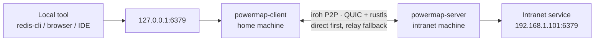

# PowerMap

<div align="center">


**Bring private-network services safely back to your local machine. No public IP, VPN, or router setup.**

[](https://github.com/steven-ld/PowerMap/actions/workflows/ci.yml)
[](https://github.com/steven-ld/PowerMap/releases)
[](LICENSE-MIT)
[](https://www.rust-lang.org/)

[Website](https://powermap.ga666666.com) · [简体中文](README.md) · **English** · [Downloads](https://github.com/steven-ld/PowerMap/releases) · [Contributing](CONTRIBUTING.md)

</div>

PowerMap is a peer-to-peer private-network access tool built on [iroh](https://iroh.computer) and QUIC. It tries to connect two machines directly, falls back to encrypted relay transport when needed, and maps an intranet service to a local port on your home computer.

```text
redis-cli ──> 127.0.0.1:6379 ──> PowerMap ──> 192.168.1.101:6379
             home machine           encrypted P2P tunnel  intranet service
```

## Why PowerMap?

| You need | PowerMap does |
|---|---|
| No public exposure | The intranet side only dials out and opens no scannable inbound port. |
| No VPN to maintain | iroh handles NAT traversal automatically; relay is a fallback, not the default. |
| Your usual tools | Services appear at `127.0.0.1:port`; keep using your browser, CLI, IDE, or database GUI. |
| Controls that are explicit | QUIC + rustls, target allowlists, independent tokens, audit logs, and resource limits. |

> PowerMap is for services you are authorized to administer. It is neither a public-exposure tool nor a replacement for an organization's identity and network policy system.

## Get Started in Three Minutes

### 1. Download or build

Download a prebuilt archive for your platform from [Releases](https://github.com/steven-ld/PowerMap/releases). For macOS Apple Silicon:

```bash
VERSION=v0.1.0
TARGET=aarch64-apple-darwin   # Intel: x86_64-apple-darwin; Linux: x86_64/aarch64-unknown-linux-gnu
BASE=https://github.com/steven-ld/PowerMap/releases/download/$VERSION

curl -LO $BASE/powermap-$TARGET.tar.gz
curl -LO $BASE/powermap-$TARGET.sha256
shasum -a 256 -c powermap-$TARGET.sha256   # verify integrity
tar xzf powermap-$TARGET.tar.gz
```

This yields the `powermap-server` and `powermap-client` executables. On Windows, download `powermap-x86_64-pc-windows-msvc.zip`.

Or build it yourself (requires Rust 1.85+):

```bash
git clone https://github.com/steven-ld/PowerMap.git
cd PowerMap
cargo build --release
```

The build produces `target/release/powermap-server` and `target/release/powermap-client`.

### 2. Start the server on an intranet machine

```bash
./powermap-server
```

On its first run, it creates:

| File | Purpose |
|---|---|
| `powermap-server.key` | Persistent node identity, keeping the node id stable. |
| `powermap-server.toml` | Server configuration and access controls. |
| `powermap-server.credential.json` | The connection credential for the client. |

Transfer `powermap-server.credential.json` securely to your home machine. It grants access to the intranet: never commit it, post it, or log it.

### 3. Start the client and create a mapping

```bash
./powermap-client --credential /path/to/powermap-server.credential.json
```

Open <http://127.0.0.1:8088> and create this mapping:

```text
Local listener: 127.0.0.1:6379
Target service: 192.168.1.101:6379
```

Then use the service as usual:

```bash
redis-cli -h 127.0.0.1 -p 6379
```

The mapping API is available as well:

```bash
curl -X POST http://127.0.0.1:8088/api/mappings \
  -H 'Content-Type: application/json' \
  -d '{"local":"127.0.0.1:6379","host":"192.168.1.101","port":6379}'
```

## Architecture



- **client (A)** listens on local ports, provides the admin UI, and maintains the encrypted connection to B.
- **server (B)** validates credentials and target allowlists, then dials the service on its intranet.
- **relays** forward ciphertext only when direct connectivity is not possible.

Each local TCP connection becomes a bidirectional QUIC stream on an existing connection. The client watchdog restores a dropped connection with exponential backoff.

## Admin UI

The UI binds to loopback only by default and shows connection state, transport path (direct P2P / relayed), and traffic metrics in real time, with light and dark themes.

| Port mappings | Connection settings |
|---|---|
|  |  |
|  |  |

## Deploy

### Docker: run the server only

The server is a good fit for an intranet appliance. `--network host` generally improves NAT-traversal success.

```bash
docker build -t powermap .

docker run -d --name powermap-server --network host \
  -v "$PWD/data:/data" \
  -e RUST_LOG=info \
  powermap powermap-server --config /data/powermap-server.toml
```

Or use Compose:

```bash
docker compose up -d --build
```

Run the client natively where possible. Its mapped ports belong to its network namespace; Docker would add per-port publishing work.

### Supported platforms

Releases include Linux x86_64 / aarch64, macOS Intel / Apple Silicon, and Windows x86_64 archives with SHA-256 checksums.

## Security Model

| Control | Details |
|---|---|
| Credential | `node_id + token` is the access entry point. Handle `credential.json` like a password. |
| End-to-end encryption | iroh's QUIC + rustls encrypts the link; relays see ciphertext only. |
| Target allowlist | CIDR and port rules limit dialable targets and prevent DNS-rebinding bypasses. |
| Multi-tenant access | `[[clients]]` supplies per-user tokens, allowlists, and concurrency caps; revoke independently. |
| Audit and limits | JSON audit events and limits on streams, mappings, connections, and dial time protect operations. |
| Admin API authentication | When `web_token` is set, only `Authorization: Bearer <token>` is accepted. Query-string tokens are rejected so secrets do not reach history, proxy, or access logs. |

**Do not publish the admin UI to the Internet.** If you change `web_bind` to `0.0.0.0`, set `web_token`, configure TLS, and restrict sources at your reverse proxy or firewall.

## Operations

The client exposes Prometheus metrics and a health endpoint:

```bash
curl http://127.0.0.1:8088/metrics
curl http://127.0.0.1:8088/api/health
```

Metrics include tunnels, handshakes, rejections, dial failures, reconnects, and bytes transferred. `/metrics` and `/api/health` do not require the admin token and expose aggregate data only; protect them at the network layer when not bound locally.

## Configuration Reference

Default config directories are `~/.config/powermap/` on Linux and `~/Library/Application Support/powermap/` on macOS. Use `--config` to override the path; command-line flags take precedence.

<details>
<summary><strong>Client configuration</strong></summary>

```toml
node_id = "a5d40b0a8d24..."
token = "991fd0a3..."
web_bind = "127.0.0.1:8088"
web_token = ""
web_tls_cert = ""
web_tls_key = ""
max_mappings = 256
max_conns_per_mapping = 512

[[mappings]]
local = "127.0.0.1:6379"
host = "192.168.1.101"
port = 6379
```

An empty `web_token` means the UI is unauthenticated; use that only for the default local bind. When set, the admin API accepts only `Authorization: Bearer <token>` and never `?token=`. The UI keeps a manually entered admin token only in current-page memory, so it must be entered again after a refresh. The client refuses to start with a non-loopback `web_bind` without a token, an unpaired TLS certificate/key, or only one of `node_id` and `token`. `max_conns_per_mapping = 0` means unlimited.
</details>

<details>
<summary><strong>Server configuration and multi-tenancy</strong></summary>

```toml
identity = "powermap-server.key"
max_streams_per_conn = 256
dial_timeout_secs = 10
audit_log = "/var/log/powermap/audit.jsonl"

[[clients]]
id = "alice"
token = "alice-token-..."
allow_networks = ["192.168.1.0/24"]
allow_ports = [6379, 5432]
max_streams = 32

[[clients]]
id = "bob"
token = "bob-token-..."
allow_networks = ["10.0.0.0/8"]
revoked = true
```

A top-level `token` remains valid for a single-tenant server and is normalized to a `default` client; startup logs make this compatibility mode explicit, so migration to `[[clients]]` is optional. To prevent silently ineffective policies, the server rejects invalid CIDRs, port `0`, and empty or duplicate client ids/tokens. Restart the server after changing `[[clients]]`, allowlists, or revocation state.
</details>

## Troubleshooting

| Symptom | What to do |
|---|---|
| Client cannot connect / server refuses it | Confirm that client `node_id` and `token` came from this server's credential file. |
| Local port cannot bind | The port is in use. Choose another port or remove the existing mapping. |
| Relay connection times out | The network or a relay may be temporarily unavailable. iroh will try other relays; retry after a short wait. |
| A config change has no effect | Config is loaded at startup. Manage runtime mappings in the UI/API; restart B after server allowlist changes. |

## Development and Contributing

```bash
cargo fmt --all
cargo clippy --all-targets -- -D warnings
cargo test
```

CI runs the same checks for every push and PR. Read [CONTRIBUTING.md](CONTRIBUTING.md) before opening an issue or PR. For security issues, contact the maintainer privately instead of filing a public issue.

## License

PowerMap is dual-licensed under [MIT](LICENSE-MIT) or [Apache-2.0](LICENSE-APACHE), at your option.
