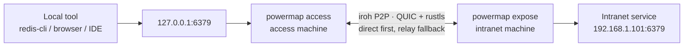

# PowerMap

<div align="center">


**Bring private-network services safely back to your local machine. No public IP, VPN, or router setup.**

[](https://github.com/steven-ld/PowerMap/actions/workflows/ci.yml)
[](https://github.com/steven-ld/PowerMap/releases)
[](LICENSE-MIT)
[](https://www.rust-lang.org/)

[Website](https://powermap.ga666666.com) · [简体中文](README.md) · **English** · [Downloads](https://github.com/steven-ld/PowerMap/releases) · [v0.4.0 Release Notes](docs/releases/v0.4.0.md) · [Contributing](CONTRIBUTING.md)

</div>

PowerMap is a peer-to-peer private-network access tool built on [iroh](https://iroh.computer) and QUIC. It tries to connect two machines directly, falls back to encrypted relay transport when needed, and maps an intranet service to a local port on your home computer.

```text
redis-cli ──> 127.0.0.1:6379 ──> PowerMap ──> 192.168.1.101:6379
             home machine           encrypted P2P tunnel  intranet service
```

## Navigate

- [Install in One Minute](#install-in-one-minute)
- [Get Started in Three Minutes](#get-started-in-three-minutes)
- [Where It Fits](#where-it-fits)
- [Deploy and Remote Administration](#deploy)
- [Security Model](#security-model)
- [Configuration Reference](#configuration-reference)
- [Troubleshooting](#troubleshooting)

## Install in One Minute

On macOS or Linux, the installer fetches the latest **verified** release and installs it to `~/.local/bin` by default. Review the script before running it if preferred.

```bash
curl -fsSLO https://raw.githubusercontent.com/steven-ld/PowerMap/main/scripts/install.sh
sh install.sh
```

Windows (PowerShell):

```powershell
Invoke-WebRequest https://raw.githubusercontent.com/steven-ld/PowerMap/main/scripts/install.ps1 -OutFile install.ps1
powershell -ExecutionPolicy Bypass -File .\install.ps1
```

The installers download the Release SHA-256 file and validate the archive before installation. Pin a version with `sh install.sh v0.4.0` or `POWERMAP_VERSION`; manual Release downloads and source builds remain available below.

## Where It Fits

| You need | PowerMap does |
|---|---|
| No public exposure | The intranet side only dials out and opens no scannable inbound port. |
| No VPN to maintain | iroh handles NAT traversal automatically; relay is a fallback, not the default. |
| Your usual tools | Services appear at `127.0.0.1:port`; keep using your browser, CLI, IDE, or database GUI. |
| Controls that are explicit | QUIC + rustls, target allowlists, independent tokens, audit logs, and resource limits. |

> PowerMap is for services you are authorized to administer. It is neither a public-exposure tool nor a replacement for an organization's identity and network policy system.

| A good fit | Not a good fit |
|---|---|
| Redis, databases, web admin panels, and IDE debug ports in a home, office, or lab network | Publishing a public website or API |
| No public IP or router control, while both machines can reach the Internet | Enterprise VPN use cases requiring SSO, device posture, and full-network routing |
| Keeping existing tools pointed at `127.0.0.1` | Networks or services you do not administer or have no authorization to access |

## Get Started in Three Minutes

### 1. Download or build

Download a prebuilt archive for your platform from [Releases](https://github.com/steven-ld/PowerMap/releases). For macOS Apple Silicon:

```bash
VERSION=v0.4.0
TARGET=aarch64-apple-darwin   # Intel: x86_64-apple-darwin; Linux: x86_64/aarch64-unknown-linux-gnu
BASE=https://github.com/steven-ld/PowerMap/releases/download/$VERSION

curl -LO $BASE/powermap-$TARGET.tar.gz
curl -LO $BASE/powermap-$TARGET.sha256
shasum -a 256 -c powermap-$TARGET.sha256   # verify integrity
tar xzf powermap-$TARGET.tar.gz
```

This yields the `powermap` executable. On Windows, download `powermap-x86_64-pc-windows-msvc.zip`.

Or build it yourself (requires Rust 1.85+):

```bash
git clone https://github.com/steven-ld/PowerMap.git
cd PowerMap
cargo build --release
```

The build produces `target/release/powermap`.

### 2. Choose “expose this network” on the intranet machine

```bash
./powermap
```

On its first run, it creates:

| File | Purpose |
|---|---|
| `powermap.key` | Persistent node identity, keeping the node id stable. |
| `powermap.toml` | Unified configuration and access controls. |
| `powermap.credential.json` | The connection credential for an access device. |

Transfer `powermap.credential.json` securely to your access machine. It grants access to the intranet: never commit it, post it, or log it.

> The first run creates the expose configuration and credential. Before a long-running deployment, at least restrict `allow_networks` and `allow_ports`; add `published_targets` when you want the console to suggest services automatically.

### 3. Choose “access a remote network” and create a mapping

```bash
./powermap
```

Open <http://127.0.0.1:8088> and create this mapping:

```text
Local listener: 127.0.0.1:6379
Target service: 192.168.1.101:6379
```

Copy the share credential from the intranet device’s Local node table, then paste it in the home device’s Remote node table. Save only after target validation passes.

Then use the service as usual:

```bash
redis-cli -h 127.0.0.1 -p 6379
```

The mapping API is available as well:

```bash
curl -X POST http://127.0.0.1:8088/api/mappings \
  -H 'Content-Type: application/json' \
  -d '{"local":"127.0.0.1:6379","host":"192.168.1.101","port":6379}'
```

**Success looks like this:** the console reports “Connected” (direct or relayed is fine), the mapping stays “Listening” or “Active”, and your local tool reaches the target through `127.0.0.1:port`.

## Architecture



- **access (A)** listens on local ports, provides the admin UI, and maintains the encrypted connection to expose.
- **expose (B)** validates credentials and target allowlists, then dials the service on its intranet.
- **relays** forward ciphertext only when direct connectivity is not possible.

Each local TCP connection becomes a bidirectional QUIC stream on an existing connection. The access capability restores a dropped connection with exponential backoff.

## Admin UI

The UI binds to loopback only by default and shows connection state, transport path (direct P2P / relayed), and traffic metrics in real time, with light and dark themes.

| Port mappings | Connection settings |
|---|---|
|  |  |
|  |  |

## Deploy

### Docker: run a unified node

A container is a good fit for an intranet appliance. `--network host` generally improves NAT-traversal success. To run expose-only, create a mounted `powermap.toml` containing only `[expose]`; without a config, the first start creates a default node with both expose and access capabilities.

```bash
docker build -t powermap .

docker run -d --name powermap --network host \
  -v "$PWD/data:/data" \
  -e RUST_LOG=info \
  powermap powermap --config /data/powermap.toml
```

Or use Compose:

```bash
docker compose up -d --build
```

Run access natively where possible. Its mapped ports belong to its network namespace; Docker would add per-port publishing work.

### Managed services and secure remote administration

Unified service templates, upgrade guidance, and SSH/mTLS Nginx remote administration are available in [deployment/README.md](deployment/README.md).

| Goal | Recommended entry point |
|---|---|
| Short-lived access from a personal computer | Run `powermap` and use the local admin UI |
| A long-running intranet device | [Managed deployment templates](deployment/README.md) |
| View the local admin UI remotely | SSH tunneling; use an mTLS gateway only when necessary |
| Automate mappings | `POST /api/mappings` with a Bearer `web_token` |

### Supported platforms

Releases include Linux x86_64 / aarch64, macOS Intel / Apple Silicon, and Windows x86_64 archives with SHA-256 checksums.

### v0.4.0 upgrade and compatibility

Starting with v0.4.0, every Release contains one `powermap` executable. The
role-specific `powermap-server` and `powermap-client` binaries are no longer
published. Start `powermap` directly; one `powermap.toml` can contain both
`[expose]` and `[access]`, or only the capability required on that machine.

When no unified config exists, the first start reads
`powermap-server.toml` / `powermap-client.toml` in the same directory and
merges them into `powermap.toml`. Legacy files are removed only after the new
config is written successfully. Mappings without `mode` continue as TCP, and a
single-tenant top-level `token` remains compatible as the `default` client.

> Before rolling back to an old role-specific binary, back up
> `powermap.toml`, `powermap.key`, and `powermap.credential.json`, as well as
> any remaining legacy role configs. Older binaries do not read the unified config.

## Security Model

| Control | Details |
|---|---|
| Credential | `node_id + token` is the access entry point. Handle `credential.json` like a password. |
| End-to-end encryption | iroh's QUIC + rustls encrypts the link; relays see ciphertext only. |
| Target allowlist | CIDR and port rules limit dialable targets and prevent DNS-rebinding bypasses. |
| Multi-tenant access | `[[expose.clients]]` supplies per-user tokens, allowlists, and concurrency caps; revoke independently. |
| Audit and limits | JSON audit events and limits on streams, mappings, connections, and dial time protect operations. |
| Admin API authentication | When `web_token` is set, only `Authorization: Bearer <token>` is accepted. Query-string tokens are rejected so secrets do not reach history, proxy, or access logs. |

**Do not publish the admin UI to the Internet.** If you change `web_bind` to `0.0.0.0`, set `web_token`, configure TLS, and restrict sources at your reverse proxy or firewall.

## Operations

The access capability exposes Prometheus metrics and a health endpoint:

```bash
curl http://127.0.0.1:8088/metrics
curl http://127.0.0.1:8088/api/health
```

Metrics include tunnels, handshakes, rejections, dial failures, reconnects, and bytes transferred. `/metrics` and `/api/health` do not require the admin token and expose aggregate data only; protect them at the network layer when not bound locally.

## Configuration Reference

Default config directories are `~/.config/powermap/` on Linux and `~/Library/Application Support/powermap/` on macOS. Use `--config` to override the path; command-line flags take precedence.

<details>
<summary><strong>Unified configuration: access</strong></summary>

```toml
[access]
node_id = "a5d40b0a8d24..."
token = "991fd0a3..."
web_bind = "127.0.0.1:8088"
web_token = ""
web_tls_cert = ""
web_tls_key = ""
max_mappings = 256
max_conns_per_mapping = 512

# Reverse mapping: expose local services to the expose intranet (deny-all by default)
reverse_enabled = false
reverse_allow_networks = []   # empty = deny all
reverse_allow_ports = []      # empty = deny all

# Domain mapping: access this domain through the remote node (HTTPS 443 by default)
[[access.domain_mappings]]
domain = "ai-router.dl-aiot.com"
remote_port = 443
enabled = true

# Plain TCP passthrough (default)
[[access.mappings]]
local = "127.0.0.1:6379"
host = "192.168.1.101"
port = 6379

# UDP passthrough (DNS, WireGuard, game servers, ...)
[[access.mappings]]
local = "127.0.0.1:53"
host = "192.168.1.1"
port = 53
mode = "udp"

# HTTP gateway: one local port routed to multiple intranet backends by Host header
[[access.mappings]]
local = "127.0.0.1:8080"
host = "192.168.1.101"   # fallback backend when no route matches
port = 80
mode = "http"
routes = [
  { host_match = "grafana.local", target_host = "192.168.1.10", target_port = 3000 },
  { host_match = "wiki.local", target_host = "192.168.1.11", target_port = 8080 },
]

```

An empty `web_token` means the UI is unauthenticated; use that only for the default local bind. When set, the admin API accepts only `Authorization: Bearer <token>` and never `?token=`. The UI keeps a manually entered admin token only in current-page memory, so it must be entered again after a refresh. The access capability refuses to start with a non-loopback `web_bind` without a token, an unpaired TLS certificate/key, or only one of `node_id` and `token`. Domain mappings are supported on macOS/Linux only and require PowerMap to be started as an administrator. They modify the system hosts file, so their create, update, toggle, and delete endpoints always require a configured `web_token`, including for local requests. Multiple domains share local `127.0.0.1:443` and route by TLS SNI, so clients must send SNI. `max_conns_per_mapping = 0` means unlimited. Domain mappings require a lowercase fully qualified DNS name (no wildcards or IP literals); omitted `remote_port` defaults to HTTPS port `443`, and omitted `enabled` defaults to enabled.

A mapping's `mode` defaults to `tcp` (plain passthrough); `udp` tunnels UDP datagrams; `http` enables a single-port HTTP gateway that matches each request's `Host` header against `routes` (up to 32), falling back to the mapping's own `host`/`port` when nothing matches (`routes` only apply in `http` mode).

Reverse mapping exposes a service on the access side (this machine or its home network) to the expose intranet — the opposite direction of a normal mapping. It is **deny-all by default**: leaving `reverse_allow_networks` and `reverse_allow_ports` empty rejects every callback, so you must explicitly set `reverse_enabled` and list the allowed networks and ports. Which intranet addresses expose listens on is set by the `reverse` entries under `[[expose.clients]]` (see below). This policy is also editable from the console.
</details>

<details>
<summary><strong>Unified configuration: expose and multi-tenancy</strong></summary>

```toml
[expose]
identity = "powermap.key"
max_streams_per_conn = 256
dial_timeout_secs = 10
audit_log = "/var/log/powermap/audit.jsonl"

[[expose.clients]]
id = "alice"
token = "alice-token-..."
allow_networks = ["192.168.1.0/24"]
allow_ports = [6379, 5432]
max_streams = 32
published_targets = [
  { host = "192.168.1.101", port = 6379, label = "Primary Redis" },
  { host = "192.168.1.102", port = 5432, label = "PostgreSQL" },
]

[[expose.clients]]
id = "bob"
token = "bob-token-..."
allow_networks = ["10.0.0.0/8"]
revoked = true

# Reverse listener: expose listens on 0.0.0.0:9000 in its intranet and
# hands each connection through the tunnel for alice's access side to dial back.
[[expose.clients.reverse]]
listen = "0.0.0.0:9000"
target_host = "127.0.0.1"
target_port = 5900
name = "Home VNC"
```

A top-level `token` remains valid for single-tenant expose and is normalized to a `default` client; startup logs make this compatibility mode explicit, so migration to `[[expose.clients]]` is optional. Reverse `reverse` entries let expose listen inside its intranet and hand inbound connections back through the tunnel for the matching access side to dial on its own side; each listen address is unique across the whole expose configuration (up to 32 per client), and a single-tenant expose config can place `reverse` at the top level. **Whether a callback is allowed is decided by the access side's `reverse_enabled`/`reverse_allow_*`** (deny-all by default) — a configured reverse listener does not mean access will accept it. `published_targets` explicitly shares IP/port suggestions with that access node. Once connected, the console rechecks them by asking expose to dial each target, then offers only currently reachable services for one-click mapping. It never expands the allowlist: every listed port must still be in `allow_ports`. To prevent silently ineffective policies, expose rejects invalid CIDRs, port `0`, and empty or duplicate client ids/tokens. Restart expose after changing clients, allowlists, published targets, or revocation, then distribute the refreshed credential file.

For single-tenant mode, place the same `published_targets = [...]` block under `[expose]`. For multi-tenant mode, put it under the matching `[[expose.clients]]` entry and retain the `published_targets` field in the credential JSON distributed to that client. The console's refresh action only rechecks these explicitly published addresses; it never scans the intranet.
</details>

## Troubleshooting

| Symptom | What to do |
|---|---|
| Access cannot connect / expose refuses it | Confirm that the access `node_id` and `token` came from this expose node's credential file. |
| Local port cannot bind | The port is in use. Choose another port or remove the existing mapping. |
| Relay connection times out | The network or a relay may be temporarily unavailable. iroh will try other relays; retry after a short wait. |
| A config change has no effect | Config is loaded at startup. Manage runtime mappings in the UI/API; restart expose after changing its allowlists or `published_targets`, then distribute the refreshed credential. |

## Development and Contributing

```bash
cargo fmt --all
cargo clippy --all-targets -- -D warnings
cargo test
```

CI runs the same checks for every push and PR. Read [CONTRIBUTING.md](CONTRIBUTING.md) before opening an issue or PR. For security issues, contact the maintainer privately instead of filing a public issue.

## License

PowerMap is dual-licensed under [MIT](LICENSE-MIT) or [Apache-2.0](LICENSE-APACHE), at your option.
