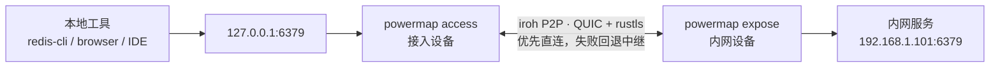
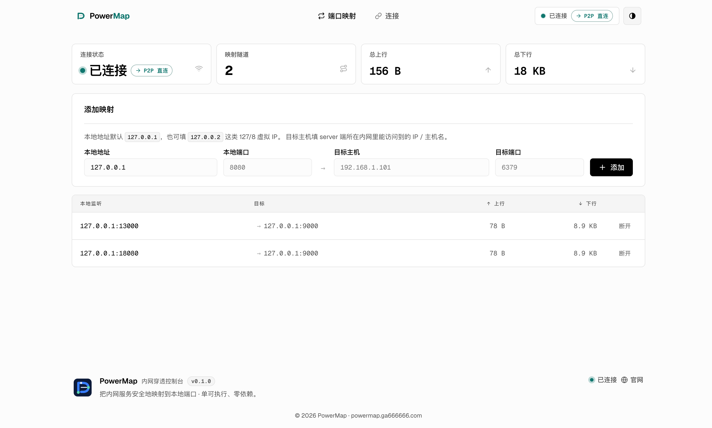
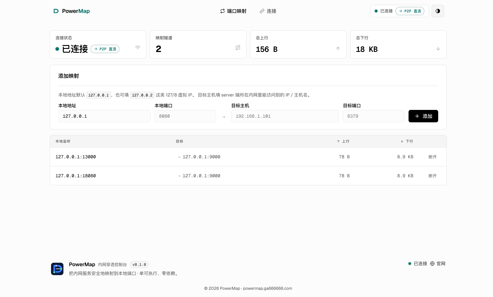
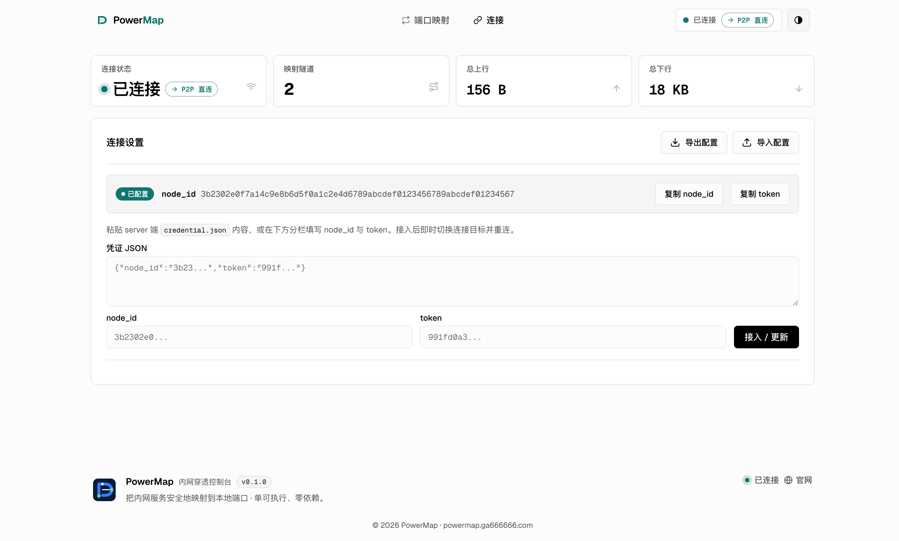

# PowerMap

<div align="center">


**把内网服务安全地带回本地。无需公网 IP、VPN 或路由器配置。**

[](https://github.com/steven-ld/PowerMap/actions/workflows/ci.yml)
[](https://github.com/steven-ld/PowerMap/releases)
[](LICENSE-MIT)
[](https://www.rust-lang.org/)

[官网](https://powermap.ga666666.com) · **简体中文** · [English](README.en.md) · [下载](https://github.com/steven-ld/PowerMap/releases) · [v0.7.0 发版说明](docs/releases/v0.7.0.md) · [贡献](CONTRIBUTING.md)

</div>

PowerMap 是基于 [iroh](https://iroh.computer) 和 QUIC 的点对点内网访问工具。它让两台机器优先直连，必要时通过加密中继回退，把内网服务映射为家中电脑上的本地端口。

```text
redis-cli ──> 127.0.0.1:6379 ──> PowerMap ──> 192.168.1.101:6379
             家中电脑             加密 P2P 隧道       内网服务
```

## 导航

- [一分钟安装](#一分钟安装)
- [三分钟跑通](#三分钟跑通)
- [适用边界](#适用边界)
- [部署与远程管理](#部署)
- [安全模型](#安全模型)
- [配置参考](#配置参考)
- [排错](#排错)

## 一分钟安装

macOS / Linux 可以使用安装脚本下载**已校验**的最新 Release；默认安装到 `~/.local/bin`。执行前可先查看脚本内容。

```bash
curl -fsSLO https://raw.githubusercontent.com/steven-ld/PowerMap/main/scripts/install.sh
sh install.sh
```

Windows（PowerShell）:

```powershell
Invoke-WebRequest https://raw.githubusercontent.com/steven-ld/PowerMap/main/scripts/install.ps1 -OutFile install.ps1
powershell -ExecutionPolicy Bypass -File .\install.ps1
```

安装脚本会下载 Release 的 SHA-256 文件并在安装前校验归档。若最新 Release 尚未上传当前平台的资产，脚本会显示对应资产和发布页；可稍后重试，或使用 `sh install.sh v0.7.0` 固定版本。也可设置 `POWERMAP_VERSION`，或继续使用下方的手动下载和源码构建方式。

## 适用边界

| 你需要的 | PowerMap 的做法 |
|---|---|
| 不开公网端口 | 内网侧只主动连出，不监听可扫描的入站端口 |
| 不维护 VPN | 两端通过 iroh 自动 NAT 打洞；直连失败时才经中继 |
| 不改变现有工具 | 服务映射为 `127.0.0.1:端口`，继续使用浏览器、CLI、IDE 或数据库 GUI |
| 不把安全交给默认设置 | QUIC + rustls 加密、目标白名单、独立 token、审计日志和资源上限 |

> PowerMap 适合远程访问你有权限管理的内网服务。它不是公网暴露工具，也不是替代组织级 VPN 的身份与网络策略系统。

| 适合 | 不适合 |
|---|---|
| 家里、办公室或实验室的 Redis、数据库、Web 管理页、IDE 调试端口 | 对外发布网站或 API |
| 没有公网 IP、无法修改路由器、但两端都能访问互联网 | 需要组织级 SSO、设备准入和全网路由的企业 VPN 场景 |
| 希望让既有工具继续连 `127.0.0.1` | 不应由你管理或无权限访问的网络与服务 |

## 三分钟跑通

### 1. 下载或构建

从 [Releases](https://github.com/steven-ld/PowerMap/releases) 下载对应平台的预编译包。以 macOS Apple Silicon 为例：

```bash
VERSION=v0.7.0
TARGET=aarch64-apple-darwin   # Intel: x86_64-apple-darwin；Linux: x86_64/aarch64-unknown-linux-gnu
BASE=https://github.com/steven-ld/PowerMap/releases/download/$VERSION

curl -LO $BASE/powermap-$TARGET.tar.gz
curl -LO $BASE/powermap-$TARGET.sha256
shasum -a 256 -c powermap-$TARGET.sha256   # 校验完整性
tar xzf powermap-$TARGET.tar.gz
```

解包得到 `powermap` 可执行文件。Windows 用户下载 `powermap-x86_64-pc-windows-msvc.zip`。

也可以自行构建（需要 Rust 1.85+）：

```bash
git clone https://github.com/steven-ld/PowerMap.git
cd PowerMap
cargo build --release
```

构建产物为 `target/release/powermap`。

### 管理页更新

在管理页“关于”的“软件更新”卡片中检查并安装最新稳定版。原生 macOS/Linux 会下载对应平台的 Release、校验 SHA-256、保留旧二进制备份并优雅重启，已有配置和映射会自动恢复。二进制所在目录必须可写；Docker 会提供宿主机的 `docker compose pull && docker compose up -d` 命令，Windows 会提供 PowerShell 安装命令。

### 2. 选择“暴露内网服务”场景

```bash
./powermap
```

首次启动会生成以下文件：

| 文件 | 用途 |
|---|---|
| `powermap.key` | 持久化节点身份，保持 node id 稳定 |
| `powermap.toml` | 统一配置与访问控制 |
| `powermap.credential.json` | 交给接入设备的连接凭证 |

把 `powermap.credential.json` 安全地传给家中电脑。它包含访问内网的凭证，不要提交到 Git、聊天群或日志。

> 首次启动会生成 expose 配置与凭证。长期运行前，至少限制 `allow_networks` 与 `allow_ports`；完整示例见 [expose 配置与多租户](#expose-配置与多租户)。

### 3. 选择“访问远端内网”场景并创建映射

```bash
./powermap
```

打开 <http://127.0.0.1:8088>，在“端口映射”中创建：

```text
本地监听：127.0.0.1:6379
目标服务：192.168.1.101:6379
```

在内网设备的“本机节点”表复制分享凭证，再到家中设备的“远端节点”表粘贴。看到“目标验证通过”后再保存映射。

之后照常使用服务：

```bash
redis-cli -h 127.0.0.1 -p 6379
```

也可以通过 API 添加映射：

```bash
curl -X POST http://127.0.0.1:8088/api/mappings \
  -H 'Content-Type: application/json' \
  -d '{"local":"127.0.0.1:6379","host":"192.168.1.101","port":6379}'
```

**成功标准**：管理页显示“已连接”（直连或经中继均可），映射状态保持“监听中/已活动”，且本地命令可以通过 `127.0.0.1:端口` 访问目标服务。

## 架构



- **access（A）**：监听本地端口，提供管理页，维护到 expose 的加密连接。
- **expose（B）**：验证凭证与目标白名单后，在所在内网拨号目标服务。
- **中继**：仅在无法直连时转发密文，无法读取隧道内容。

每一条本地 TCP 连接都在已建立的 QUIC 连接上复用双向流。连接断开时，access 能力会通过看门狗与指数退避恢复连接。

## 界面

管理页默认仅绑定本地回环，实时显示连接状态、传输路径（P2P 直连 / 经中继）与流量指标，并支持浅色 / 深色主题。

| 端口映射 | 连接设置 |
|---|---|
|  |  |
|  |  |

## 部署

### Docker：运行统一节点

容器适合部署在内网设备或盒子中。发布镜像位于 [GitHub Container Registry](https://github.com/steven-ld/PowerMap/pkgs/container/powermap)，支持 `linux/amd64` 与 `linux/arm64`。`--network host` 通常能提高 NAT 打洞成功率；如需 expose-only，先在挂载目录中创建只含 `[expose]` 的 `powermap.toml`。

建议固定版本启动，配置和节点身份持久化到当前目录的 `data/`：

```bash
mkdir -p data
docker pull ghcr.io/steven-ld/powermap:v0.7.0
docker run -d --name powermap --restart unless-stopped \
  --network host \
  -v "$(pwd)/data:/data" \
  -e RUST_LOG=info \
  ghcr.io/steven-ld/powermap:v0.7.0 \
  powermap --config /data/powermap.toml
```

也可使用 Compose：

```bash
POWERMAP_TAG=v0.7.0 docker compose up -d
```

升级时在 Compose 项目目录运行
`POWERMAP_TAG=vX.Y.Z docker compose pull && POWERMAP_TAG=vX.Y.Z docker compose up -d`；管理页会为检测到的 Docker 环境生成对应命令。未提供配置时，首次启动会生成具备 expose 和 access 能力的默认节点。

access 建议原生运行：映射的本地端口位于 access 所在网络命名空间，放入 Docker 会额外增加逐端口发布的管理成本。

### 受管服务与安全远程管理

统一 systemd 服务、升级方式以及保持管理页回环监听的 SSH / mTLS Nginx 远程管理方案，见 [deployment/README.md](deployment/README.md)。

| 目标 | 推荐入口 |
|---|---|
| 个人电脑临时访问 | 直接运行 `powermap`，使用本地管理页 |
| 长期运行的内网设备 | [受管部署模板](deployment/README.md) |
| 远程查看本地管理页 | SSH 隧道；只有确有需要时才部署 mTLS 网关 |
| 自动化创建映射 | `POST /api/mappings` |

### 支持的平台

Release 提供 Linux x86_64 / aarch64、macOS Intel / Apple Silicon 与 Windows x86_64 的预编译包，并附带 SHA-256 校验文件。

### v0.4.0 升级与兼容性

v0.4.0 起，Release 只包含一个 `powermap` 可执行文件：不再需要、也不再发布
`powermap-server` 与 `powermap-client`。直接启动 `powermap`；同一份
`powermap.toml` 可同时包含 `[expose]` 和 `[access]`，也可只保留其中一个场景。

首次启动时，如果统一配置尚不存在，程序会自动读取同目录的
`powermap-server.toml` / `powermap-client.toml`，合并为 `powermap.toml`。只有新文件
成功写入后旧文件才会删除，避免迁移失败丢失配置。旧映射没有 `mode` 时按 TCP 处理，
单租户顶层 `token` 仍兼容为 `default` 客户。

> 如需回退到旧版二进制，请先备份 `powermap.toml`、`powermap.key`、
> `powermap.credential.json`，以及尚存的旧 role 配置。旧二进制不会读取统一配置。

## 安全模型

| 控制项 | 说明 |
|---|---|
| 访问凭证 | `node_id + token` 是访问入口。像密码一样保存 `credential.json`。 |
| 端到端加密 | iroh 的 QUIC + rustls 加密所有链路；中继只见密文。 |
| 目标白名单 | expose 能力可用 CIDR 和端口限制可拨号目标，并避免 DNS 重绑定绕过。 |
| 多租户 | `[[expose.clients]]` 为每个使用者配置独立 token、白名单、并发上限，可单独吊销。 |
| 审计与资源限制 | 每次拨号可记录 JSON 审计日志；并发流、映射数、连接数与拨号超时均有限制。 |
| 管理 API 鉴权 | 当前版本未启用；`web_token` 字段仅为未来兼容保留。 |

**不要将管理页直接暴露到公网。** 当前版本的管理 API 未启用应用层鉴权；若将 `web_bind` 改为 `0.0.0.0`，请通过反向代理、VPN 或防火墙限制访问来源。

## 运维

access 能力暴露 Prometheus 指标和健康检查：

```bash
curl http://127.0.0.1:8088/metrics
curl http://127.0.0.1:8088/api/health
```

指标包含隧道、握手、拒绝、拨号失败、重连和收发字节。`/metrics` 与 `/api/health` 不要求管理页 token，仅输出聚合数据；若监听到非本地地址，请在网络层限制抓取来源。

## 配置参考

默认配置目录：Linux 为 `~/.config/powermap/`，macOS 为 `~/Library/Application Support/powermap/`。使用 `--config` 指定其他路径；命令行参数优先于配置文件。

<details>
<summary><strong>统一配置：access</strong></summary>

```toml
[access]
node_id = "a5d40b0a8d24..."
token = "991fd0a3..."
web_bind = "127.0.0.1:8088"
web_token = ""
web_tls_cert = ""
web_tls_key = ""
max_mappings = 256
max_conns_per_mapping = 512

# 反向映射：把本机服务暴露给 expose 所在内网（默认全禁，需显式开启）
reverse_enabled = false
reverse_allow_networks = []   # 留空 = 全部拒绝
reverse_allow_ports = []      # 留空 = 全部拒绝

# 域名映射：通过远端节点访问此域名（默认 HTTPS 443）
[[access.domain_mappings]]
domain = "ai-router.dl-aiot.com"
remote_port = 443
enabled = true

# 默认 TCP 透传
[[access.mappings]]
local = "127.0.0.1:6379"
host = "192.168.1.101"
port = 6379

# UDP 透传（DNS、WireGuard、游戏服务器等）
[[access.mappings]]
local = "127.0.0.1:53"
host = "192.168.1.1"
port = 53
mode = "udp"

# HTTP 网关：单端口按 Host 头分流到多个内网后端
[[access.mappings]]
local = "127.0.0.1:8080"
host = "192.168.1.101"   # 未命中任何路由时的兜底后端
port = 80
mode = "http"
routes = [
  { host_match = "grafana.local", target_host = "192.168.1.10", target_port = 3000 },
  { host_match = "wiki.local", target_host = "192.168.1.11", target_port = 8080 },
]

```

`web_token` 是保留字段：当前版本不读取、不生成、不校验它，管理 API 不要求 Bearer token。域名映射仅支持 macOS/Linux，必须以管理员身份启动 PowerMap；它会修改系统 hosts 文件。多个域名共享本机 `127.0.0.1:443`，按 TLS SNI 分流，客户端必须发送 SNI。`max_conns_per_mapping = 0` 表示不限制。域名映射要求小写的完整 DNS 域名（不接受通配符或 IP 地址）；省略 `remote_port` 时默认使用 HTTPS 的 `443`，省略 `enabled` 时默认启用。

映射的 `mode` 省略时为 `tcp`（裸透传）；`udp` 走 UDP 数据报隧道；`http` 启用单端口 HTTP 网关，按请求 `Host` 头匹配 `routes`（最多 32 条），未命中则回落到该映射的 `host`/`port` 兜底后端（`routes` 仅在 `http` 模式有效）。

反向映射把 access 一侧（本机或家庭网络）的服务暴露给 expose 所在内网，方向与正向相反。它**默认全部拒绝**：`reverse_allow_networks` 与 `reverse_allow_ports` 留空即拒绝一切回拨，必须显式启用 `reverse_enabled` 并列出允许的网段与端口才放行。具体在内网监听哪些地址由 `[[expose.clients.reverse]]` 决定（见下）。可在管理页中编辑该策略。
</details>

<details>
<summary><strong>expose 配置与多租户</strong></summary>

```toml
[expose]
identity = "powermap.key"
max_streams_per_conn = 256
dial_timeout_secs = 10
audit_log = "/var/log/powermap/audit.jsonl"

[[expose.clients]]
id = "alice"
token = "alice-token-..."
allow_networks = ["192.168.1.0/24"]
allow_ports = [6379, 5432]
max_streams = 32
published_targets = [
  { host = "192.168.1.101", port = 6379, label = "Redis 主库" },
  { host = "192.168.1.102", port = 5432, label = "PostgreSQL" },
]

[[expose.clients]]
id = "bob"
token = "bob-token-..."
allow_networks = ["10.0.0.0/8"]
revoked = true

# 反向监听：expose 在内网 0.0.0.0:9000 监听，把连接经隧道交给 alice 的 access 一侧回拨
[[expose.clients.reverse]]
listen = "0.0.0.0:9000"
target_host = "127.0.0.1"
target_port = 5900
name = "家中 VNC"
```

顶层 `token` 也可用于单租户部署；它会兼容地映射为 `default` 客户，并在启动日志中明确提示，无需立刻迁移到 `[[expose.clients]]`。反向监听 `reverse` 让 expose 在其内网监听，把入站连接经隧道交回对应 access 一侧回拨自己一侧的目标；监听地址在整个 expose 配置内唯一（最多 32 条/客户），单租户可把 `reverse` 写在顶层。**是否放行由 access 侧的 `reverse_enabled`/`reverse_allow_*` 决定**（默认全禁）——配置反向监听不代表 access 会接受。`published_targets` 是显式分享给该 access 节点的 IP/端口候选；连接成功后，控制台会由 expose 实际拨号检查，只显示当前可用的服务并支持一键填入。它不放宽白名单，端口必须仍在 `allow_ports` 中。为避免策略被静默覆盖，expose 会拒绝无效 CIDR、端口 `0`、空或重复的客户 id/token。变更 `[[expose.clients]]`、白名单、推荐目标或吊销状态后需要重启 expose，并重新分发凭证文件。

单租户把同一段 `published_targets = [...]` 写在 `[expose]` 下；多租户则写在对应的 `[[expose.clients]]` 下，并在分发给该客户的凭证 JSON 中保留 `published_targets` 字段。控制台的“刷新”只重新检测这些明确发布的地址，不会扫描整个内网。
</details>

## 排错

| 现象 | 处理方式 |
|---|---|
| 无法连接或被 expose 拒绝 | 核对 access 使用的 `node_id` 与 `token` 是否来自该 expose 节点的凭证文件。 |
| 本地端口绑定失败 | 端口已被占用；更换端口，或删除已有的同名映射。 |
| 中继连接超时 | 网络或中继可能短暂波动；iroh 会尝试切换中继，稍候重试。 |
| 修改配置后没有生效 | 配置在启动时读取。运行期映射请通过管理页或 API 维护；改 expose 白名单或 `published_targets` 后重启 expose，并重新分发凭证。 |

## 开发与贡献

```bash
cargo fmt --all
cargo clippy --all-targets -- -D warnings
cargo test
```

CI 会在每个 push 和 PR 上运行相同检查。提交 Issue 或 PR 前请阅读 [CONTRIBUTING.md](CONTRIBUTING.md)。安全问题请不要公开提交 Issue，而应私下联系维护者。

## License

PowerMap 采用 [MIT](LICENSE-MIT) 或 [Apache-2.0](LICENSE-APACHE) 双许可，你可以任选其一。
