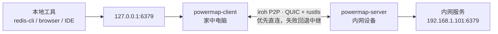

# PowerMap

<div align="center">


**把内网服务安全地带回本地。无需公网 IP、VPN 或路由器配置。**

[](https://github.com/steven-ld/PowerMap/actions/workflows/ci.yml)
[](https://github.com/steven-ld/PowerMap/releases)
[](LICENSE-MIT)
[](https://www.rust-lang.org/)

[官网](https://powermap.ga666666.com) · **简体中文** · [English](README.en.md) · [下载](https://github.com/steven-ld/PowerMap/releases) · [贡献](CONTRIBUTING.md)

</div>

PowerMap 是基于 [iroh](https://iroh.computer) 和 QUIC 的点对点内网访问工具。它让两台机器优先直连，必要时通过加密中继回退，把内网服务映射为家中电脑上的本地端口。

```text
redis-cli ──> 127.0.0.1:6379 ──> PowerMap ──> 192.168.1.101:6379
             家中电脑             加密 P2P 隧道       内网服务
```

## 为什么用它？

| 你需要的 | PowerMap 的做法 |
|---|---|
| 不开公网端口 | 内网侧只主动连出，不监听可扫描的入站端口 |
| 不维护 VPN | 两端通过 iroh 自动 NAT 打洞；直连失败时才经中继 |
| 不改变现有工具 | 服务映射为 `127.0.0.1:端口`，继续使用浏览器、CLI、IDE 或数据库 GUI |
| 不把安全交给默认设置 | QUIC + rustls 加密、目标白名单、独立 token、审计日志和资源上限 |

> PowerMap 适合远程访问你有权限管理的内网服务。它不是公网暴露工具，也不是替代组织级 VPN 的身份与网络策略系统。

## 三分钟跑通

### 1. 下载或构建

从 [Releases](https://github.com/steven-ld/PowerMap/releases) 下载对应平台的预编译包。以 macOS Apple Silicon 为例：

```bash
VERSION=v0.1.0
TARGET=aarch64-apple-darwin   # Intel: x86_64-apple-darwin；Linux: x86_64/aarch64-unknown-linux-gnu
BASE=https://github.com/steven-ld/PowerMap/releases/download/$VERSION

curl -LO $BASE/powermap-$TARGET.tar.gz
curl -LO $BASE/powermap-$TARGET.sha256
shasum -a 256 -c powermap-$TARGET.sha256   # 校验完整性
tar xzf powermap-$TARGET.tar.gz
```

解包得到 `powermap-server` 与 `powermap-client` 两个可执行文件。Windows 用户下载 `powermap-x86_64-pc-windows-msvc.zip`。

也可以自行构建（需要 Rust 1.85+）：

```bash
git clone https://github.com/steven-ld/PowerMap.git
cd PowerMap
cargo build --release
```

构建产物为 `target/release/powermap-server` 和 `target/release/powermap-client`。

### 2. 在内网设备启动 server

```bash
./powermap-server
```

首次启动会生成以下文件：

| 文件 | 用途 |
|---|---|
| `powermap-server.key` | 持久化节点身份，保持 node id 稳定 |
| `powermap-server.toml` | server 配置和访问控制 |
| `powermap-server.credential.json` | 交给 client 的连接凭证 |

把 `powermap-server.credential.json` 安全地传给家中电脑。它包含访问内网的凭证，不要提交到 Git、聊天群或日志。

### 3. 在家中电脑启动 client 并创建映射

```bash
./powermap-client --credential /path/to/powermap-server.credential.json
```

打开 <http://127.0.0.1:8088>，在“端口映射”中创建：

```text
本地监听：127.0.0.1:6379
目标服务：192.168.1.101:6379
```

之后照常使用服务：

```bash
redis-cli -h 127.0.0.1 -p 6379
```

也可以通过 API 添加映射：

```bash
curl -X POST http://127.0.0.1:8088/api/mappings \
  -H 'Content-Type: application/json' \
  -d '{"local":"127.0.0.1:6379","host":"192.168.1.101","port":6379}'
```

## 架构



- **client（A）**：监听本地端口，提供管理页，维护到 server 的加密连接。
- **server（B）**：验证凭证与目标白名单后，在所在内网拨号目标服务。
- **中继**：仅在无法直连时转发密文，无法读取隧道内容。

每一条本地 TCP 连接都在已建立的 QUIC 连接上复用双向流。连接断开时，client 会通过看门狗与指数退避恢复连接。

## 界面

管理页默认仅绑定本地回环，实时显示连接状态、传输路径（P2P 直连 / 经中继）与流量指标，并支持浅色 / 深色主题。

| 端口映射 | 连接设置 |
|---|---|
|  |  |
|  |  |

## 部署

### Docker：推荐只部署 server

server 适合部署在内网设备或盒子中。`--network host` 通常能提高 NAT 打洞成功率。

```bash
docker build -t powermap .

docker run -d --name powermap-server --network host \
  -v "$PWD/data:/data" \
  -e RUST_LOG=info \
  powermap powermap-server --config /data/powermap-server.toml
```

或使用 Compose：

```bash
docker compose up -d --build
```

client 建议原生运行：映射的本地端口位于 client 所在网络命名空间，放入 Docker 会额外增加逐端口发布的管理成本。

### 支持的平台

Release 提供 Linux x86_64 / aarch64、macOS Intel / Apple Silicon 与 Windows x86_64 的预编译包，并附带 SHA-256 校验文件。

## 安全模型

| 控制项 | 说明 |
|---|---|
| 访问凭证 | `node_id + token` 是访问入口。像密码一样保存 `credential.json`。 |
| 端到端加密 | iroh 的 QUIC + rustls 加密所有链路；中继只见密文。 |
| 目标白名单 | server 可用 CIDR 和端口限制可拨号目标，并避免 DNS 重绑定绕过。 |
| 多租户 | `[[clients]]` 为每个使用者配置独立 token、白名单、并发上限，可单独吊销。 |
| 审计与资源限制 | 每次拨号可记录 JSON 审计日志；并发流、映射数、连接数与拨号超时均有限制。 |

**不要将管理页直接暴露到公网。** 如果将 `web_bind` 改为 `0.0.0.0`，请设置 `web_token`，启用 TLS，并在反向代理或防火墙层限制访问来源。

## 运维

client 暴露 Prometheus 指标和健康检查：

```bash
curl http://127.0.0.1:8088/metrics
curl http://127.0.0.1:8088/api/health
```

指标包含隧道、握手、拒绝、拨号失败、重连和收发字节。`/metrics` 与 `/api/health` 不要求管理页 token，仅输出聚合数据；若监听到非本地地址，请在网络层限制抓取来源。

## 配置参考

默认配置目录：Linux 为 `~/.config/powermap/`，macOS 为 `~/Library/Application Support/powermap/`。使用 `--config` 指定其他路径；命令行参数优先于配置文件。

<details>
<summary><strong>client 配置</strong></summary>

```toml
node_id = "a5d40b0a8d24..."
token = "991fd0a3..."
web_bind = "127.0.0.1:8088"
web_token = ""
web_tls_cert = ""
web_tls_key = ""
max_mappings = 256
max_conns_per_mapping = 512

[[mappings]]
local = "127.0.0.1:6379"
host = "192.168.1.101"
port = 6379
```

`web_token` 为空表示管理页不鉴权；仅适用于默认本地监听。`max_conns_per_mapping = 0` 表示不限制。
</details>

<details>
<summary><strong>server 配置与多租户</strong></summary>

```toml
identity = "powermap-server.key"
max_streams_per_conn = 256
dial_timeout_secs = 10
audit_log = "/var/log/powermap/audit.jsonl"

[[clients]]
id = "alice"
token = "alice-token-..."
allow_networks = ["192.168.1.0/24"]
allow_ports = [6379, 5432]
max_streams = 32

[[clients]]
id = "bob"
token = "bob-token-..."
allow_networks = ["10.0.0.0/8"]
revoked = true
```

顶层 `token` 也可用于单租户部署；它会兼容地映射为 `default` 客户。变更 `[[clients]]`、白名单或吊销状态后需要重启 server。
</details>

## 排错

| 现象 | 处理方式 |
|---|---|
| 无法连接或被 server 拒绝 | 核对 client 使用的 `node_id` 与 `token` 是否来自该 server 的凭证文件。 |
| 本地端口绑定失败 | 端口已被占用；更换端口，或删除已有的同名映射。 |
| 中继连接超时 | 网络或中继可能短暂波动；iroh 会尝试切换中继，稍候重试。 |
| 修改配置后没有生效 | 配置在启动时读取。运行期映射请通过管理页或 API 维护；改 server 白名单后重启 server。 |

## 开发与贡献

```bash
cargo fmt --all
cargo clippy --all-targets -- -D warnings
cargo test
```

CI 会在每个 push 和 PR 上运行相同检查。提交 Issue 或 PR 前请阅读 [CONTRIBUTING.md](CONTRIBUTING.md)。安全问题请不要公开提交 Issue，而应私下联系维护者。

## License

PowerMap 采用 [MIT](LICENSE-MIT) 或 [Apache-2.0](LICENSE-APACHE) 双许可，你可以任选其一。
